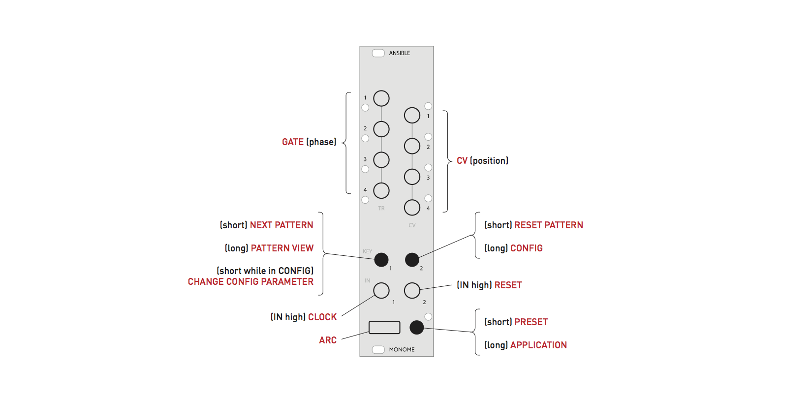
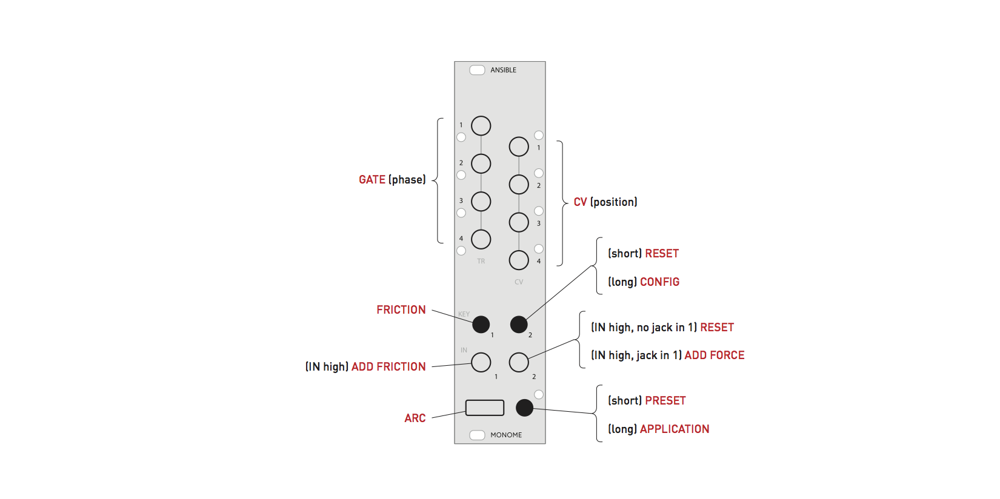
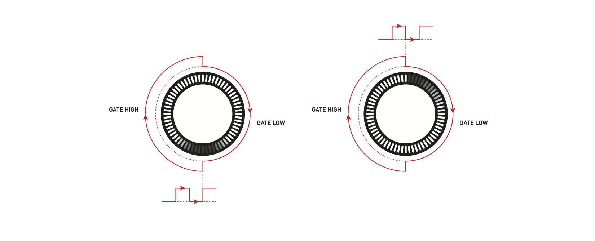
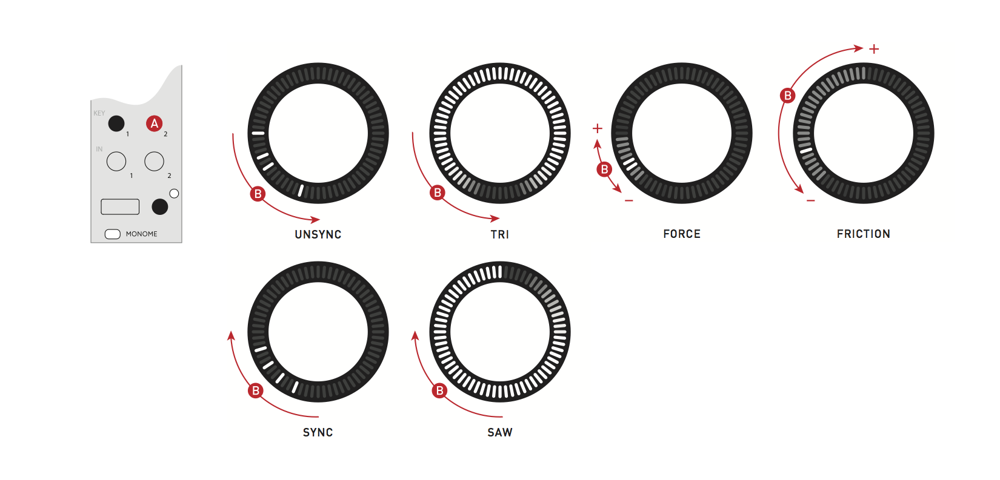
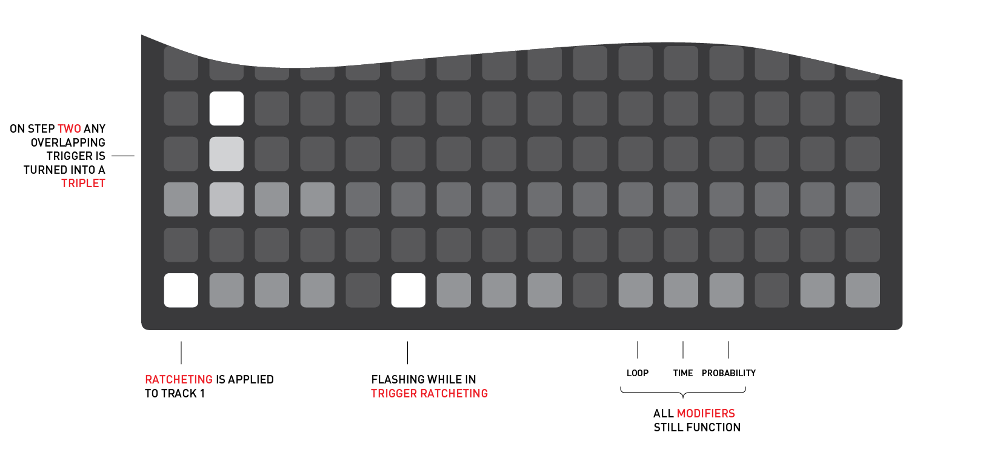
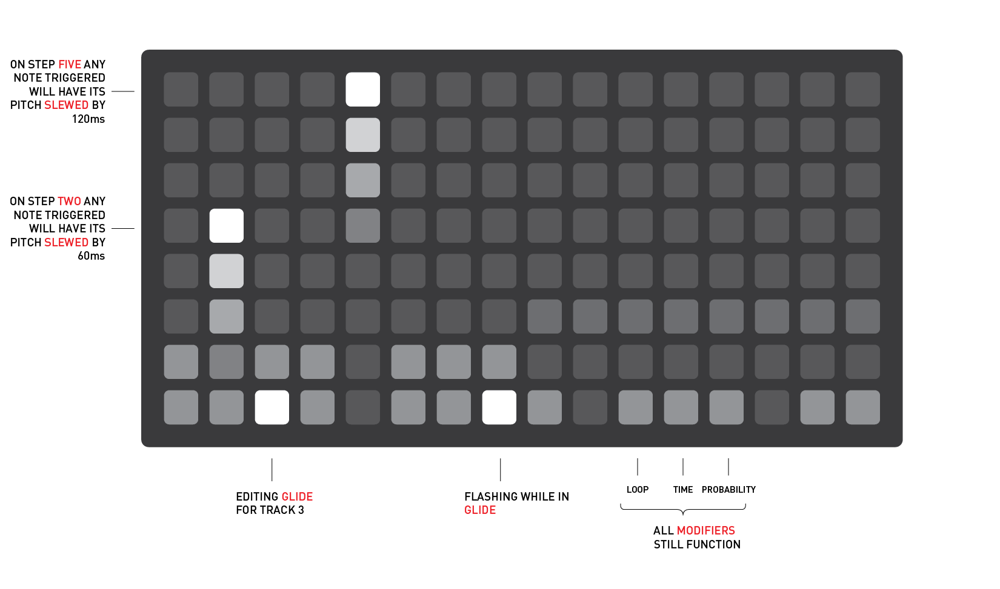
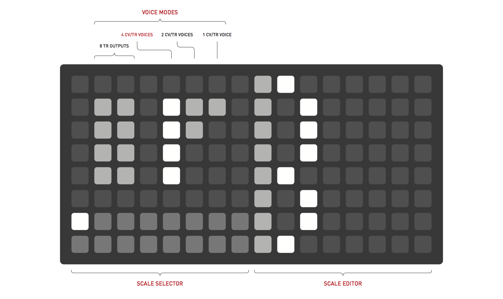

<div class="vid"><iframe src="https://player.vimeo.com/video/182119406?color=ff7700&title=0&byline=0&portrait=0" width="860" height="483" frameborder="0" webkitallowfullscreen mozallowfullscreen allowfullscreen></iframe></div>


# Ansible

*Far communicator, speaks openly.*

Connects to Grids, Arcs, and MIDI devices, integrating external controllers into the modular environment. Also extends Teletype. Many modes are available, activated by connecting different USB devices and a preset key:

* Kria (Grid) live step sequencer, polyphasic parameters, emergent patterns.
* Meadowphysics (Grid) rhizomatic cascading counter.
* Levels (Arc) rotational pattern instrument.
* Cycles (Arc) physically manipulated waves.
* Reach (Teletype) further ecosystem output and input.
* Traffic (MIDI) device voice allocation and various arpeggiation.

**Grid, Arc, MIDI device, or Teletype required.**

* Eurorack
* 6hp width
* 39mm depth


## Installation

Align the 10-pin ribbon cable so the red stripe corresponds to the white indicator on the rear of the module’s circuit board. This is toward the lower edge of the module.

Be careful not to misalign the connector left-to-right either – while Ansible is protected against incorrect connection, doing so may damage other modules in your Eurorack case.

If you wish Ansible to communicate with Teletype you will need to attach the II ribbon cable behind the panel. Be sure to align the red stripe on the cable with the white line on the board.

Secure the module with the two included screws.

*Power consumption:*

These are maximums. Power consumption varies greatly based on which USB controller is attached and how many LEDs are being lit. You can drastically lower your +12V consumption by using a [Switch](/docs/modular/switch/) with your USB controller.

- 200mA @ +12V
- 19ma @ -12V
- No +5v required

## Firmware Updates

Ansible ships with a strange USB A-A cable. This is used for firmware updates. We expect to be adding features from time to time, and the Ansible is a good candidate for community hacking. It's suggested to update your firmware to ensure you're running the newest version-- so the following documentation will be applicable rather than confusing.

Firmware update information [instructions are available](http://monome.org/docs/modular/update/).

## Basics


Output and input functionality vary according to which application is running.

Applications are determined by which USB device is plugged in. For example, when you plug in a Grid it will be running Kria. Hold the preset key (next to the USB port) to switch to Meadowphysics. Ansible will remember which application you were last running between power-ups.

Unplugging the Grid and plugging an Arc will change to Levels.

With nothing plugged in the Ansible works as a Teletype input/output extender.

Modes are indicated with a white or orange LED near the mode key.

## Levels (Arc)

Levels allows Arc encoders to assign voltages to CV outputs and create patterns which can be clocked.

The mode LED will show orange when running.

### Basics



Each Arc ring is its own output unit and all encoders have the same capabilities. The leftmost ring (ring 1) uses CV/TR 1, ring 2 use CV/TR 2, and so on.

Turning the ring will change its value, and affect its output CV/TR. By default each ring is in VOLT mode, which is a continuous CV output from 0-10v. In VOLT mode the TR output is a pulse whose period relates to the ring position-- leftwards is slower, rightwards is faster.

This can be changed to NOTE mode which maps the ring to a semitones, with octave markers. CV output is volt per octave, and TR is used for indicating PATTERN changes (more on this later).


### Config

Enter the CONFIG "view" by pushing and holding `KEY 2` on the panel. The Arc display will change-- the first CONFIG view is *mode*, which allows toggling between VOLT and NOTE mode. Each setting is per-ring for every screen, so each ring can have a different configuration.

Pushing `Key 1` while holding `Key 2` will change the CONFIG parameter, as shown in the following diagram:


**Mode** - VOLT vs EDIT mode, also enable/disable ALL-EDIT mode.

**Range/Scale** - in VOLT mode we set Range, which specifies either full (0-10v), half (0-5v), or quarter (0-2.5v). In NOTE mode we set Scale, which lets you select various scale modes to confine values within.

**Offset/Octave** - in VOLT mode we set Offset, which adds a fixed voltage to ring values. 5v is marked at the north position. In NOTE mode we set Octave from 0-5 which similarly adds octaves to ring values.

**Slew** - for both modes, Slew is the transition time to new values on pattern change.

### Patterns

Levels has 16 patterns to work with-- pattern is the set of four values assigned to rings.

We can cycle to the next pattern with a short press of `Key 1`. On the next pattern we can set new values for the rings. `Key 2` will reset us back to the start pattern.

We can set the pattern start and length by holding `Key 1` to get into PATTERN mode.


Ring 1 and 2 provide read/write functions. The current pattern is shown dimly. If we rotate ring 1 to a new position and release `Key 1` we move to that position. Similarly for ring 2, we move to the given position but overwrite that pattern with whatever our current values are set at. It's a way of copying values between patterns.

Ring 3 lets you move the pattern start position.

Ring 4 lets you change the pattern length. The length can be reverse, which will make patterns move in the other direction when clocked.

Parameters within CONFIG are fixed across patterns, but can differ between PRESETS.

### Clocking

When a cable is present in `In 1` we can clock Levels to change patterns with a low-to-high pulse. A pulse to `In 2` will reset the pattern position to start.

When clocking externally editing is a little different. `Key 1` and `Key 2` still navigate edit position just the same, but the outputs of all CV/TR reflect the current *play* position dictated by the external clock. The play position is reflected in the PATTERN view.

You can dynamically change the PATTERN start and length while externally clocking pattern changes. I recommend trying this out.


### Presets


A short press to the `preset` key (next to the USB port) will enter PRESET mode.

The current preset will be shown dimly. Rotate to one of the other slots press either `Key 1` or `Key 2` to read and write respectively. Or press `preset` again to cancel.

Presets are written to flash, and the most recently used preset will be loaded upon power-up.


## Cycles (Arc)

Cycles converts Arc gestures into rotational energy mapped to CV and TR outputs, with control for friction and force.

The mode LED will show white when running.

### Basics



Each ring has its own rotational momentum: turn the ring to accelerate in either direction. Each ring's current position is mapped to its respective CV and TR output.

The CV value is determined by the ring's Shape which is either Triangle (default) or Saw. A Tri shape has the CV output high towards to north side of a ring, and low towards the south side. A Saw shape is a gradual increase from low to high when rotating clockwise from north.

The TR value is a phase indicator. On the right side of a ring TR is low, on the left it is high.



Friction can be introduced by pushing and holding `Key 1`.

A short press to `Key 2` will reset all positions to 0 (north).

### Config

Enter CONFIG mode by holding down `Key 2`.



 * Ring 1 - Mode: Unsync/Sync
 * Ring 2 - Shape: Tri/Saw
 * Ring 3 - Force: ring sensitivity
 * Ring 4 - Friction: constant friction amount

### Sync mode

By default Cycles is in Unsync mode, where each ring is independent.

In Sync mode Ring 1 determines the base speed, and the remaining rings follow by a given multiple. Touching ring 2-4 in Unsync mode changes this multiple.


### Presets


A short press to the `preset` key (next to the USB port) will enter PRESET mode.

The current preset will be shown dimly. Rotate to one of the other slots press either `Key 1` or `Key 2` to read and write respectively. Or press `preset` again to cancel.

Presets are written to flash, and the most recently used preset will be loaded upon power-up.


## Kria (Grid)

This is an updated version of Kria which began as a White Whale alt-firmware. While some functionality has changed, a general overview could be understood by viewing the [alt-WW Kria tutorial video](https://vimeo.com/153923660).

### Interface


 * `Key 1`: Time View
 * `Key 2`: Config View

 * `In 1`: Clock (rising edge)
 * `In 2`: Reset (rising edge)

### Basic

Four tracks of sequencers. Each track outputs to its respective CV/TR pair as pitch and gate.

The main grid view uses the bottom row for navigation, which are dimly lit into blocks and highlight the current setting:

 * 1-4: Track
 * 6-9: Trigger, Note, Octave, Duration
 * 11-13: MODIFIERS: Loop, Time, Probability
 * 15: Scale
 * 16: Pattern


### Parameters

Each *track* has four parameters *Trigger, Note, Octave,* and *Duration*. These parameters work together to form the sequence loop. 

Select a parameter to adjust by pressing its key in the bottom row of the grid.

A *note* will occur only when a *trigger* is set. This note will be the pitch specified by *note* in *octave* of a specified *duration*.

The *trigger* view shows all four tracks at once, whereas all other parameter views display the track selected.

The *duration* view has downward sliders (lower is longer) and a master duration multiplier at the top.

There are also 'sub-pages' for more advanced extensions to each of these main parameters; see "**extended parameters**" for details.

### Modifiers

Change the loop position by holding the *loop* modifier and pressing a new position. Change the loop length by pushing and holding a start position while selecting an end position. Press and release the start position to set the loop length to 1.

The *time* view shows the current clock divider.

The *probability* view is a per-step probability for each parameter. There are four levels which specify likelihood of execution by percentage: 100, 75, 50, and 0. By default all are at 100%. 0% serves as a step mute of the specified parameter.

Loops and time dividers are per parameter, per track, and so the phasing of parameters a fundamental feature of Kria.

### Extended parameters

Many of the parameter views have "sub-pages" that extend or augment their functionality. To enter into each sub-page, switch to the parameter using keys 6-9, then tap the parameter key again. When you are in the sub-page for a parameter, its paramater key will be blinking. Press the parameter again to return to the main parameter view.

| Parameter | Extended Parameter |
| --------- | ------------------ |
| Trigger   | Trigger Ratcheting |
| Note      | "Alternate Note"   |
| Octave    | Glide              |
| Duration  | *none*             |

Just like the primary parameter pages, each of the extended parameter subpages have their own probability, clock division and loop controls. This allows for some very complex phrasing to be built.

#### Trigger Ratcheting

*Trigger ratcheting* allows multiple, regularly-spaced gates to be emitted for a single trigger in the grid.

To enter the ratcheting page, press the trigger parameter key a second time when you are in the trigger view. The trigger parameter key will blink.

Ratcheting uses rows 3-6 to determine the number of sub-triggers that will fire for each trigger column. Selecting row 6 will cause no extra triggers to fire for that step. Selecting row 5 causes 1 extra trigger to fire, effectively turning an 8th note into two 16th notes. Row 4 will cause 2 extra triggers, for a total of 3, turning the single trigger into a triplet. Finally row 3 will cause 3 extra triggers to fire - effectively turning an 8th note into 4 32nd notes.




#### Alternate Note

*Alternate note* effectively allows a second note sequence to be specified for a track.

To enter the alternate note page, press the note parameter key a second time when you are in the note view. The note parameter key will blink.

The alternate note parameter screen is functionally identical to the main note screen, with its own probability, clock, division, and loop. 

Both note pages - main and alternate - are *additive*. When a note from each screen is played simultaneously, the indices of the keys within the scale are added together, and then mapped to the current scale. 

For example: if a note from each page is triggered and both are in the bottom row of the scale - "note 0" - then the CV output is for `0 + 0 = 0`, ie, note zero, the root of the scale. If the current main note is the 4th  key up (index *3* of the scale) and the alt-note is the 3rd key up (index *2*). This step in the sequence will output `3+2 = 5` index 5 of the scale, ie, the 6th note.

Note that if the combined index is above 6, the final index will be `index modulo 6`. Or, in less mathematical terms, it will 'wrap around' to the bottom of the scale again: if the main note is the note 5 (index 4) and the alternate note is note 6 (index 5), the final index would not be `4+5 = 9` but `(4+5) % 6 = 3` - index 3, or the *fourth* note of the scale.

The possibilities for alternate note become particularly interesting if you alter its probability or clock division, or if its loop points take it out of phase with the main note.

#### Glide

*Glide* allows up to 120ms of glide time to be added between triggered notes.

To enter the glide page, press the octave parameter key a second time when you are in the octave view. The octave parameter key will blink.

The glide view screen allows the user to slew the currently playing note into the next triggered note. This is controlled by setting a slider on each step column. Row 7 has a slew of 0ms, effectively a pass through. from here up each row increases the slew time to the note in the current column. Row 6 is 20ms row 5 is 40ms all the way to 120ms in row 1.



### Quick track muting

Holding the *loop* modifer and pressing a track button will mute it; pressing again will unmute.

### Scale

All tracks get their note values from this one scale.

The lower portion of the left side is the scale selector. 16 scales slots are available, with preset scale modes loaded by default. The scale editor occupies the right side.

Scales are constructed from the bottom row up. (In this case, the bottom row is the row above the navigation row). The bottom row is the root note. Add overall transposition by changing this bottom row to the right, where each point corresponds to a semitone.

Moving upwards through the rows, each row specifies a number of semitones to be added to the previous scale note, building an ascending scale.

For example, a whole tone scale (2 semitones per note) would be constructed by setting all rows to the second position. (The *zero* position is indicated dimly. Scale notes set to zero will be identical to the previous scale step).

Scales are shared between Kria and Meadowphysics, and are saved to flash whenever a preset of either is saved.

The top-left four keys on the *scale* page are used to toggle Teletype clocking for a given channel; see below for more details.

### Patterns

Patterns are shown along the top row, with 16 available total. Push a pattern key momentarily to load that pattern. *Hold* a pattern key to store the current pattern into it; it will pulse when the pattern is stored. Remember that loading an 'empty' pattern will effectively clear the current pattern.

#### Pattern Cueing
Pattern cueing allows the user to select the next pattern to be played, based off of pattern clock timing. To cue a pattern hold the *Pattern* button while pushing the next pattern to play. The top row will indicate which pattern is cued to play next

The second row on the pattern pages represents the *Cue* clock. Pushing a key in this row to set the number of steps for the cue clock.

A cued pattern is activated when the cue clock returns to zero. This clock represents a global quantize for pattern cueing.

This clock setting can be modified by the *Time* modifier, allowing you to get extremely long pattern cue time quantization.


#### Meta Patterns
The *Meta-Pattern* mode allows you to create sequences of patterns, with control over the number of times a pattern loops before moving on to the next one.

To enter the *Meta-Pattern* mode, hold down the pattern button and select any button on row 7.

When *Meta-Pattern* is activated the rows on your grid are:

|Row|Function|
|---|---|
|1| This is your normal pattern row|
|2| Is a clock divider that determines the length between each step of the *meta-sequencer*. Think of it like a clock for row 7. This is a global setting|
|3| Pattern steps 1 - 16|
|4| Pattern steps 17 - 32|
|5| Pattern steps 33 - 48|
|6| Pattern steps 49 - 64|
|7| The *meta-sequencer* row. This hold the duration for your selected pattern|
|8|Normal navigation row|

Rows 3 through 6 are where you store your patterns in a *Pattern Sequence*. Each button in this row can have 2 pieces of data associated with it, a pattern and a duration.


To edit the data just select the *pattern sequence* button you wish to change. It will glow at the maximum brightness. Selecting a pattern from row 1 will now change the pattern in the currently selected step.

You can also change the duration the pattern is played by selecting the end step of the *meta-sequencer* on row 7. Visually the *meta-sequencer* will show you the sequence length for the current step **and** the end point of the selected patterns duration at maximum brightness.

The *meta-sequencer* is clocked by the divider in row 2 and controls how long the current pattern will play before moving on to the next pattern. Row 2 itself is clocked by the current tempo (either internal or external), however if you hold the *Duration* modifier you can subdivide the current tempo driving the row 2 clock divider, for extremely long step times.

The *loop* modifier can effect the length and start position of the *pattern sequence* in rows 3-6. The same multi touch gestures while holding the *loop* modifier work in these rows. This loop will wrap around the end. And like other views, you can push the same position twice to create a single-slot loop. Pushing a *pattern sequence* once while holding the *loop* modifier will cause the current loop to start at the new position.

If you hold the *pattern* button down and select a sequence step in row 3-6 the meta-pattern will jump to that position the next time the pattern advances.

Last, but not least you can edit your patterns live while the *meta-pattern* is running. This can be slightly off putting with quickly changing patterns, but is a great way to live edit your patterns within the context of a larger sequence.

n-So has created a very informative [video](https://www.youtube.com/watch?v=ZWBXLsbxWlw) that covers all of this in a mere 6 minutes.

### Time

Hold `Key 1` to change the timing.

With nothing present in `In 1` the device is internally clocked. A pulse indicator is shown in the top row. Row 2 is *rough* and row 3 is *fine*, for jumping time intervals. The four keys in the middle are for incremental time movement, right and leftwards by fine and rough intervals.


With a cable present in `In 1` the device is externally clocked. The time view now shows a clock division multiplier in row 2.


### Config

Kria has two parameters, represented on the left and right quadrants of the grid when `Key 2` is held down.

**Note Sync** can be toggled on or off on the left side by touching any key-- the square icon will be lit bright when Note Sync is on.

When Note Sync is on, *Note* and *Trigger* editing is linked. In Note view, you can now press on a step's current note value to toggle off the Trigger at that step, and this is reflected in the interface. This way you can edit note sequences intuitively with rests without switching between two views.

Note Sync requires that Loop Sync is in Track or All mode, as the sync interface does not make sense if loops are desynchronized between Note and Trigger.

**Loop Sync** is shown on the right quadrant of the grid. There are three modes:

* None (nothing lit): all tracks and parameters can have independent loop points
* Track (top single block lit): all parameters within tracks have the same loop, but tracks can differ in their looping
* All (bottom row of 4 lit): all tracks and parameters have a synchronized loop

By default Note Sync is on and Loop Sync is set to Track.

### Presets


A short press of the `preset` key will enter preset mode.

There are 8 preset slots available, indicated in the first column of the grid. The current preset is lit.

To read a preset, press the position to select, and then press again to read.

To write a preset, press and hold the position to write to.

A "glyph" can be drawn in the right 8x8 quadrant as a visual cue as to what the preset is all about. This will be displayed when presets are selected for reading.

### Teletype Clocking

A channel of Kria can be set to be clocked from the Teletype command `KR.CLK x` (see below).

To do so, press the *scale* key to enter scale view. The four leftmost keys in the top row will enable or disable Teletype clocking for the relevant channel. When a channel is clocked by Teletype, it no longer responds to the master clock (set either internally or by an external clock connected to the `In 1`).


## Meadowphysics (Grid)

*Rhizomatic cascading counter*

The version for Ansible has a few changes from the [version 2](https://vimeo.com/146731772) (which is an update from [version 1](http://monome.org/docs/modular/meadowphysics/))-- primarily in that this new version can map a scale of notes to the individual row triggers. Those linked docs will give some additional insight (though perhaps also some confusion) prior to the completion of the material below.

### Interface


 * `Key 1`: Time View
 * `Key 2`: Config View

 * `In 1`: Clock (rising edge)
 * `In 2`: Reset (rising edge)

### Basic


Per row, each position counts down from right to left.

An *event* happens when position falls off left edge, whereupon:

 * the count resets
 * a note or trigger is generated (see *Config* further on)
 * a *rule* is applied

Set the *count* by pressing a key in the respective row, from 2-16 intervals.

The *count* can also be a range:

 * press and hold one position while pressing another position on the same row to specify a range.
 * by default the count will increment per event and wrap when a range is specified (the *increment* rule is default).

### Reset, Output, and Speeds


Press and hold the left column to configure that row:

```
col 3: STOP/START
col 4: RESET
    by default, self is toggled on. toggle on other rows for this row to reset those rows
    way to make one-shots
col 5: PLAY MODE
    toggles on/off for all rows. send trigger when new count is chosen ("play" trigger on key press)
col 6-7: RESET ACTION
    col 6: GATE. toggle state on reset
    col 7: TRIGGER. pulse output on reset. pulse length is one full clock period.
    one row can gate/trigger other rows, not just itself. or no rows.
right half of grid: speeds
    rightwards is slower, as clock division. number of ticks to wait per countdown
        can specify range of speeds, also by default incrementing
```

### Rules


Hold the left two keys to access rules screen. Parameters are similarly per row:

```
col 5-7 triple: RULE SEND
    choose vertical position to specify the destination row that rule will be applied to
    left: rule applies to position
    middle: rule applies to speed
    right: rule applies to both position and speed
right half: top to bottom select
    none, inc, dec, min, max, rand, pole, stop
```

### Time

Hold `Key 1` to change the timing.

With nothing present in `In 1` the device is internally clocked. A pulse indicator is shown in the top row. Row 2 is *rough* and row 3 is *fine*, for jumping time intervals. The four keys in the middle are for incremental time movement, right and leftwards by fine and rough intervals.


With a cable present in `In 1` the device is externally clocked. The time view now shows a clock division multiplier in row 2.


### Config



The left selection of shapes specifies the voice mode. They are (from left to right)

 * 8 TR outputs
 * 4 CV/TR voices
 * 2 CV/TR voices
 * 1 CV/TR voice

In 8 TR mode each row's *event* is a pulse or gate. The other voice modes map a note to each row. When the row's *event* occurs this note is sent to a CV/TR pair.

In the 1,2,4 voice modes the scale selector is also shown.

The lower portion of the left side is the scale selector. 16 scales slots are available, with preset scale modes loaded by default. The scale editor occupies the right side.

Scales are constructed from the bottom row up. The bottom row is the root note. Add overall transposition by changing this bottom row to the right, where each point corresponds to a semitone.

Moving upwards through the rows, each row specifies a number of semitones to be added to the previous scale note, building an ascending scale.

For example, a whole tone scale (2 semitones per note) would be constructed by setting all rows to the second position. (The *zero* position is indicated dimly. Scale notes set to zero will be identical to the previous scale step).

Scales are shared between Kria and Meadowphysics, and are saved to flash whenever a preset of either is saved.

### Clocking and Reset

Use `In 1` to externally clock. `In 2` will reset all rows back to their *count*.

### Presets


A short press of the `preset` key will enter preset mode.

There are 8 preset slots available, indicated in the first column of the grid. The current preset is lit.

To read a preset, press the position to select, and then press again to read.

To write a preset, press and hold the position to write to.

A "glyph" can be drawn in the right 8x8 quadrant as a visual cue as to what the preset is all about. This will be displayed when presets are selected for reading.


## MIDI/voice

Various MIDI-to-CV tools.

The mode LED will show white when running.

### Interface

  * `Key 1`: Panic (clear all tr/cv)
  * `In 1`: Panic

  * `Key 2`: Change allocation style
  * `In 2`: (nothing currently)

### Allocation style 1: POLY

CV/TR output pitch and gate respectively for incoming MIDI notes. CV/TR pairs rotated per MIDI note as a shift register, allowing polyphonic voice mapping.

MIDI sustain and +/- 1 octave pitch bend supported.

### Allocation style 2: MONO

One voice, monophonic. With extra parameter mappings:

```
CV 1: Pitch
CV 2: Velocity
CV 3: Aftertouch/channel pressure
CV 4: Mod
TR 1: Gate
TR 2: Damper/sustain (cc64)
TR 3: Generic (cc80)
TR 4: MIDI clock (16th note timing as of firmware 1.4)
```

+/- 1 octave pitch bend supported.

### Allocation style 3: MULTI

4 pairs of CV/TR mapped in simple MONO pitch/gate outputs responding to MIDI channels 1-4.

### Allocation style 4: FIXED

TR mapped to notes C4, D4, E4, F4 (60,62,64,65).

CV mapped to CC 16,17,18,19

Enter learning mode by holding `Key 1` and pressing `preset` (all CV/TR will clear). As unique notes and/or CC messages are received they are mapped to the next available CV/TR output respectively. Once all outputs are mapped all LEDs will go out. Press `Key 1` (panic) to cancel learning.

### Preset

_as of Ansible firmware 1.4_

Holding `Key 2` and a short press on `preset` saves the current value for the following to flash as the default (mode light blinks once):

  * selected voice allocation mode
  * pitch slew (set via teletype)
  * pitch offset (set via teletype)
  * fixed mapping

Holding `Key 2` and a long press on `preset` will clear the stored configuration and reset back to default vaules (mode light blinks twice).

The default pitch offset is -2 octaves which is the equivalent of issuing the following Teletype command `MID.SHIFT N -24`.


## MIDI/arp

The mode LED will show orange when running.

### Interface

  * `Key 1`: tap tempo / force internal clock (press twice)
  * `In 1`: sync / ext clock

  * `Key 2`: arp style:
     * as played       _(as of firmware 1.4)_
     * up
     * down
     * up/down (tri)
     * up and down (repeat high/low note)
     * converge
     * diverge
     * random

  * `In 2`: reset

Each CR/TR pair is a voice playing the arpeggio at a different divisions of the clock, initially divisions of `1,2,3,4` respectively.

Additional parameters can be controlled via CC input:

  * CC 16: Internal tempo (when not clocked by in 1 or MIDI clock)
  * CC 17: Gate length (course divisions sync'd to the clock)
  * CC 18: Scale clock division for voices 2-4:
      * `1,2,3,4`
      * `1,4,6,8`
      * `1,6,9,12`
      * `1,8,12,16`

 If MIDI clock is received it will be used as the clock source when no external clock is present.

### Preset

_as of Ansible firmware 1.4_

Holding `Key 2` and a short press on `preset` saves the current value for the following to flash as the default (mode light blinks once):

  * clock period
  * selected arp style
  * hold mode (on/off)
  * pitch slew values
  * pitch shift values
  * pattern repeat values
  * euclidean rhythm parameters

Holding `Key 2` and a long press on `preset` will clear the stored configuration and reset back to default vaules (the mode light blinks twice).

## Teletype

Teletype firmware 1.3 or newer is required for Ansible support.

With no USB device plugged in Ansible continues to run the most recently used application. For example, Kria can continue playing.

By hitting the `preset` key (next to the USB port) with no device plugged, Ansible will toggle into Teletype mode. In this mode the Ansible's outputs and inputs function as an extender, fitting naturally into the Teletype system.

This requires the Ansible to be on the internal *II* bus, a 6 conductor ribbon behind the panel. This ribbon ships with the Ansible. Be sure to align the red stripe when connecting.

### Output

By default Ansible's 4 TR outputs and 4 CV outputs are mapped as TR 5-8 and CV 5-8. All Teletype output commands are available:

```
TR 5 1          // set Ansible TR 1 to 1
TR 5            // read Ansible TR 1
TR.TOG 6        // toggle Ansible TR 2
TR.POL 7 0      // reverse polarity for Ansible TR 3 pulse
TR.TIME 7 250   // set Ansible TR 3 pulse time to 250 ms
TR.PULSE 7      // pulse Ansible TR 3
TR.TIME 7       // read Ansible TR 3 pulse time

CV.SLEW 5 100   // set Ansible CV 1 slew to 100 ms
CV 5 V 10       // set Ansible CV 1 to 10 volts
CV 5            // read Ansible CV 1
CV.SET 5 0      // set Ansible CV 1 to 0, no slew
CV.SLEW 5       // read Ansible CV 1 slew
CV.OFF 6 V 1    // set Ansible CV 2 offset to 1 volt
CV.OFF 6        // read Ansible CV 2 offset
```

### Input

Ansible's `In 1`, `In 2`, `Key 1`, and `Key 2` are mapped to `STATE` 9-12 respectively.

```
STATE 9         // read Ansible In 1
STATE 10        // read Ansible In 2
STATE 11        // read Ansible Key 1
STATE 12        // read Ansible Key 1
```

### II Address for Multiple Ansible

If using more than one Ansible connected to Teletype, the II address can be set by holding the `preset` key in combination with `Key 1` and `Key 2`. There is no visual confirmation, simply hold the combination for 2 seconds. The set address is saved to flash and will persist with power cycling.

The address is according to the following:

```
Address         Key 1   Key 2
0               off     off
1               on      off
2               off     on
3               on      on
```

Mappings for input and output are shifted for each address:

```
Address         Out     In
0               5-8     9-12
1               9-12    13-16
2               13-16   17-20
3               17-20   21-24
```

## Parameter control via Teletype

Teletype can control various parameters for Kria, Meadowphysics, Levels, and Cycles.

### Kria

```
KR.PRE x        read preset x
KR.PRE          return current preset number
KR.PERIOD x     set internal clock period to x
KR.PERIOD       return current internal clock period
KR.PAT x        set pattern to x
KR.PAT          return current pattern
KR.SCALE x      set scale to x
KR.SCALE        return current scale
KR.POS x y z    set position to z for track x parameter y
                a value of 0 for x means all tracks
                a value of 0 for y means all parameters
                parameters: 0 = all, 1 = trigger, 2 = note, 3 = octave, 4 = length
KR.POS x y      return position of track x parameter y
KR.L.ST x y z   set loop start to z for track x parameter y
KR.L.ST x y     return loop start of track x parameter y
KR.L.LEN x y z  set length to z for track x parameter y
KR.L.LEN x y    return loop length of track x parameter y
KR.RES x y      set position to loop start for track x parameter y
KR.CV x         current CV value of output x
KR.MUTE x y     set the mute of track x to y (where y=1 is muted, y=0 is not.) 
                if x is 0, set all mutes to state y
KR.TMUTE x      toggle mute for Kria track x (0 = all)
                toggle will _invert current state_.
KR.CLK x        send to clock track x (0 == all) IF track is enabled to be clocked
                by Teletype (see above)
```

### Meadowphysics

```
MP.PRE x        read preset x
MP.PRE          return current preset number
MP.SCALE x      set scale to x
MP.SCALE        return current scale
MP.PERIOD x     set internal clock period to x
MP.PERIOD       return current internal clock period
MP.OFF x        stop channel x (0 = all)
MP.RES x        reset channel x (0 = all) (also used as "start")
MP.CV x         get current CV value of output x
```

### Levels

```
LV.PRE x        read preset x
LV.PRE          return current preset number
LV.RES x        reset. x = 0 for soft reset (will reset on next ext clock), 1 for hard reset
LV.POS x        set current position
LV.POS          return current position
LV.L.ST x       set loop start
LV.L.ST         return current loop start
LV.L.LEN x      set loop length
LV.L.LEN        return current loop length
LV.L.DIR x      set loop direction
LV.L.DIR        return current loop direction
```

### Cycles

```
CY.PRE x        read preset x
CY.PRE          return current preset number
CY.RES x        reset channel x (0 = all)
CY.POS x y      set position of channel x to y (scaled 0-255) (x = 0 means all)
CY.POS x        return position of channel x (scaled 0-255)
CY.REV x        reverse direction of channel x (0 = all)
```

### MIDI

_Supported as of Teletype firmware 1.4 and Ansible firmware 1.4._

```
MID.SLEW t      set pitch slew time in ms (applies to all allocation styles expect FIXED)
MID.SHIFT o     shift pitch cv by standard tt pitch value (e.g. N 6, V -1, etc)


ARP.HLD h       0 disables key hold mode, other values enable
ARP.STY y       set base arp style [0-7] (see above for style list)
ARP.GT v g      set voice gate length [0-127], scaled/synced to course divisions of voice clock
ARP.SLEW v t    set voice slew time in ms

ARP.RPT v n s   set voice pattern repeat, n times [0-8], shifted by s semitones [-24, 24]

ARP.DIV v d     set voice clock divisor (euclidean length), range [1-32]
ARP.FIL v f     set voice euclidean fill, use 1 for straight clock division, range [1-32]
ARP.ROT v r     set voice euclidean rotation, range [-32, 32]
ARP.ER v f d r  set all euclidean rhythm

ARP.RES v       reset voice clock/pattern on next base clock tick

ARP.SHIFT v o   shift voice cv by standard tt pitch value (e.g. N 6, V -1, etc)
```

## Contributions

Diagrams by [Piotr Szyhalski / Laborcamp](http://laborcamp.org)

MIDI design and code by [Greg Wuller / ngwese](https://github.com/ngwese)
