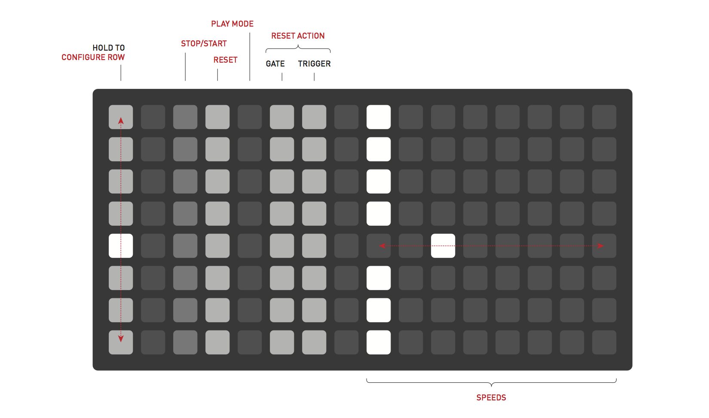
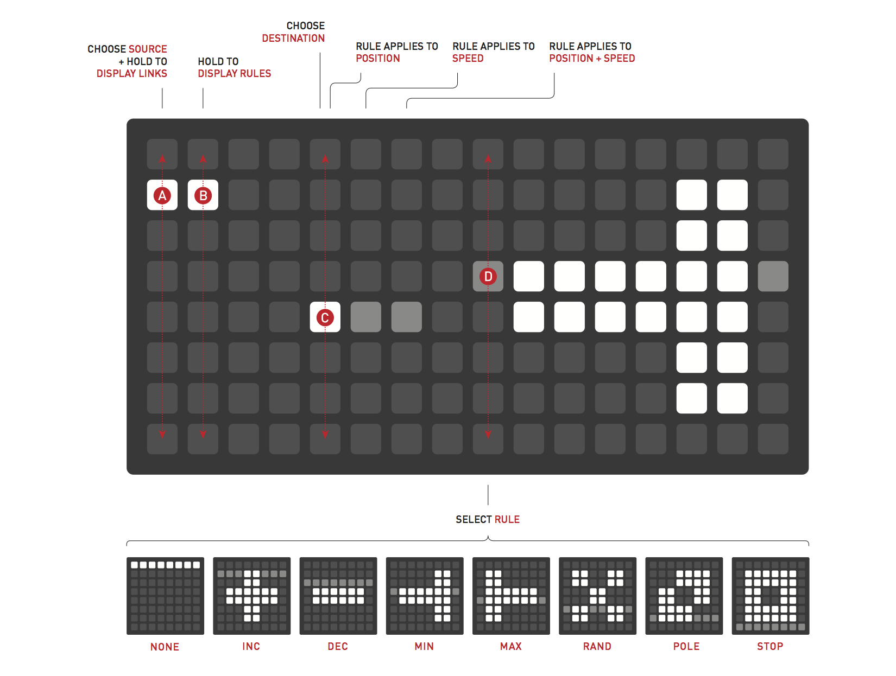
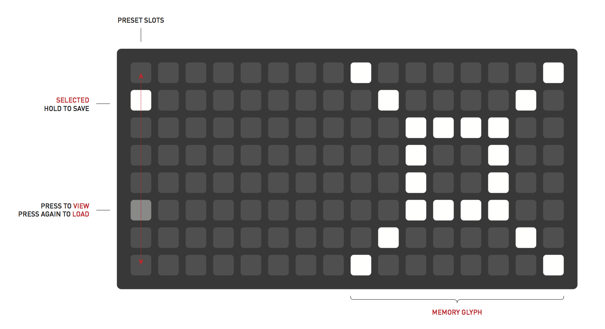

<div class="vid"><iframe src="https://player.vimeo.com/video/146731772?color=ffffff&title=0&byline=0&portrait=0" width="640" height="360" frameborder="0" webkitallowfullscreen mozallowfullscreen allowfullscreen></iframe></div>

# Meadowphysics

*Grid-enabled Rhizomatic Cascading Counter*

---

*Note: this manual is for version 2 (which also runs on Ansible). Version 1 is [available here](https://monome.org/docs/modular/meadowphysics/v1/).*

## Introduction

Meadowphysics facilitates the exploration of polyrhythms and rule-based sequencing, producing a wide range of emergent patterns.

A monome grid is plugged into the front panel of the module, becoming a complete interface. The sequence continues running when the grid is disconnected, facilitating both live performance and precomposed playback of generative systems.

Meadowphysics is composed of eight counters, one per row, falling toward zero. When a counter reaches zero, an *Event* is triggered. *Events* can send CV triggers through the numbered jack associated with the row, toggle the on / off state of the associated jack, reset the row or any other row's count, or execute and apply a rule to itself or another counter.

Each counter is configured via the main grid interface, setting the number of counts per row before an event is created. The internal clock, or externally patched clock input, can be divided per counter.

Each counter can manipulate any other row. Any combination of cross-assignments is possible, enabling the intuitive creation of very complicated long-form mutating polyrhythms.

When counters hit zero and create events, they can also trigger *Rules* on themselves or other counters. The length of the effected counter, normally set by the grid, can be reassigned by these Rules. Rules can increment, decrement or randomize Count, amongst others. Interlinking these Rules between different counters, long evolving patterns will emerge.

Through carefully balanced interlinked counters and rules, complex rhythms can be created that push and pull in ways not associated with digital sequences. These non-linear, rhizomatic sequences become particularly interesting when they respond to user input, allowing one to guide the structure into musical territory.

Full configurations are preset-able and savable to flash for later recall and instant resume on power-up.


## Installation

**Align the ribbon cable so the red stripe corresponds to the white indicator on the rear of the module's circuit board.**

- Be careful not to misalign the connector left-to-right either as it can damage this module, and other's in your case.
- Secure the module in your case with included screws, hiding under blue tape in the box.

As mentioned at top, monome modules require high +5v current. Before powering up your case, make sure the power supply can provide at least 600mA of current on the +5v line. Even if it appears to work in an underpowered case, it may degrade slowly over time until it fails and destroys the Meadowphysics. These repairs are not warrantied.

Power consumption:

- 18mA @ +12V
- 17mA @ -12V
- 42mA @ +5V (no grid connected), **up to 600mA (with grid)**

## Getting Started

(Hint: video tutorial at the bottom).

Connect your monome grid (via SWITCH or offworld usb if used) to the Meadowphysics panel. Eight counters are represented vertically on the grid, echoed onto the eight output jacks on the panel. As each counter reaches the left edge of the grid, it outputs a trigger as indicated by the panel led, and is reset to its starting *Count*. Turn the *clock* knob to watch the speed of the counters advance faster or slower.

Each row's timing, or *count*, is set by a press along the given row, excluding the far left column.

Hold the leftmost key to see a row's configuration. The row on which you hold the leftmost key is the *source*.

### Row Configuration

Press and hold the left column to configure that row:

```
col 3: STOP/START
col 4: RESET
    by default, self is toggled on. toggle on other rows for this row to reset those rows
    way to make one-shots
col 5: PLAY MODE
    toggles on/off for all rows. send trigger when new count is chosen ("play" trigger on key press)
col 6-7: RESET ACTION
    col 6: GATE. toggle state on reset
    col 7: TRIGGER. pulse output on reset. pulse length is one full clock period.
    one row can gate/trigger other rows, not just itself. or no rows.
right half of grid: speeds
    rightwards is slower, as clock division. number of ticks to wait per countdown
        can specify range of speeds, also by default incrementing
```

### Count, Position & Clock

*Count* is indicated by the dim bar in each row. It represents the number of clock pulses this row requires before creating its own event. Pressing a key will change the row's *count* and reset the countdown *position* to this new maximum. *Count* moves once per clock pulse, divided by the rows clock division. Set the clock division by holding rows left most button, then pressing any key on the right half of the grid. The further right the clock divider selection is, the slower the count will move for that row.

*Position* is indicated by the moving bright light in each row. It moves from right to left, creating a trigger event when it reaches 'zero' at the leftmost edge.

Internal clock speed is controlled by the *clock* knob. If a cable is attached to the clock *in* the internal clock is disabled. Clock *out* sends out the current clock which is additionally indicated by the panel led near the jack.

### Resets

While pressing the left most key in a row, the rows that it will *reset* are shown as bright lights in column four. When the selected row count hits zero, the resets associated with that row will be triggered, resetting those row counts back to their count position. The row reset can also reset itself and in typical situations does.

### Rules & Ranges

Holding the leftmost (*link*) key in a row, then adding the second to left key will display that row's *rule* and destination. This *rule* can change the *count* of the destination row, within that rows chosen *range*.

Select the destination of a rule by pressing column 5 or 6 of the row the rule should effect. The column selection allows the rule to effect the position, speed or both,

* Column 5: the rule effects the position.
* Column 6: the rule effects the speed.

Change the rule by pressing the right half of the grid. Select vertically and a glyph is displayed. Most *rules* require a *range* to be selected.

Define a *range* by holding a count and selecting another position. this defines the maximum and minimum.

By default the "increment" rule is selected. On each execution, count will be increased. If max is hit, the next execution will be the minimum.

Other rules do different things, listed from top to bottom:

* none: do nothing.
* increment: increase by 1. wrap if at top.
* decrement: decrease by 1. wrap if at bottom.
* max: go to maximum.
* min: go to minimum.
* random: go to random count within range.
* pole: go to min or max, whichever is furthest away.
* stop: stop.


## Preset

Entire collections of sixteen patterns can be saved to internal flash. On power-up the most recently saved set will be recalled and will play instantly.


To access the memory system, push the key next to the USB port on the module's panel. The display on the grid will change to display the *Preset* system. Either storage locations are accessed from the left most column. The current Preset is indicated with a bright led.

- Press a key in the left column to select a *Preset*.
- Press again to **load** the selected Preset.
- Hold a key to **save** the current state to the given Preset.
- Press the panel key again to escape Preset mode (ie *cancel*).

To quick-save the current memory slot, push and hold the panel key. The grid will display the *Preset* system, then return to the current pattern after quick-save is complete. This is handy to quickly save your work before powering down the synthesizer.

Each *Preset* has an associated *glyph* available on the right 8x8 quadrant. Press keys here to draw a visual cue to associate with your *Preset*. It is saved with the current data when holding a preset slot.

It is possible to backup all your presets as part of the module's firmware; see [modular firmware updates](/docs/modular/update/).

## Video Tutorial

<div class="vid"><iframe src="https://player.vimeo.com/video/146731772?color=ffffff&title=0&byline=0&portrait=0" width="640" height="360" frameborder="0" webkitallowfullscreen mozallowfullscreen allowfullscreen></iframe></div>
