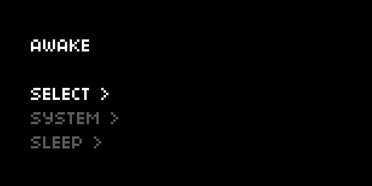
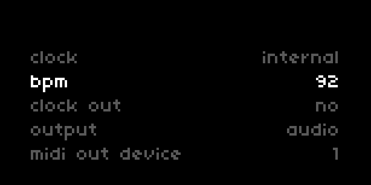
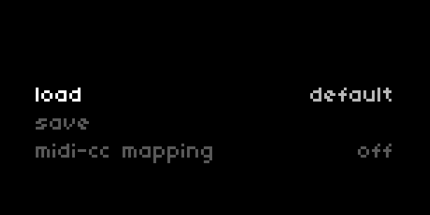

# norns

**current version: [190404](https://github.com/monome/norns/releases)**

- [first](norns-legend.pdf) is a one-sheet quick introduction.
- [studies](/docs/norns/study-1/) -- series of tutorials for creating scripts

quick links: [begin](#begin) &mdash; [awake](#awake) &mdash; [edit](#edit)

## legend

## begin

The mini-USB plug provides power and charges the internal battery. Use the cable and power supply provided. (The included supply supplies 2A via USB connector).

Hold KEY1 for three seconds.

Be still, and norns will awaken.

There's a small light near the power plug.  ORANGE means power.  WHITE means disk access.

On the bottom of the norns there is a tiny push switch will hard power-off the device. For general shut down use the _sleep_ menu function. This fully turns off the norns with a proper software shutdown. Use the bottom switch only if something in software went wrong.

## awake

A changing melody will play.

-- TODO

(bonus: try plugging in a grid.)

TAP KEY1 quickly to enter EDIT.

## edit

Tap K1 quickly to toggle between PLAY and EDIT.

In EDIT mode:

- E1 moves between pages.
- E2 scrolls up/down.
- K2/K3 move back/forward.

Page layout:

### SELECT

Explore the collection of scripts.  Selecting a script will show a description.  Forward again will run the script.  The play screen will return upon running.  Tap KEY1 to toggle between PLAY and MENU.

### SYSTEM

- AUDIO - Like the parameter list, but for the global audio settings. Includes output and input levels, headphone gain, aux send (reverb), and insert (compression). See the REFERENCE section below for details on the parameters available.
- DEVICES - This is a list of connected USB hardware (currently MIDI and grids) with their associated port number. Most scripts address port 1. See [norns study 4](https://monome.org/docs/norns/study-4/) for a scripting guide to multiple ports. This menu lets you re-assign connected devices to specific ports.
- WIFI -
- UPDATE - Checks for updates. Internet connection required.
- RESET - Quickly resets the audio system.
- SLEEP - Powers down.

### PARAMETERS

Scripts can define their own parameters. ENC2 scrolls and ENC3 changes parameter values.

HOLD KEY1 to access parameter set saving and loading:

- ENC3 scrolls set number (0 is default, with 1-99 available)
- KEY2 loads the selected set
- KEY3 saves the set to the selected position

Note that some scripts may have no parameters.

-- TODO: midi mapping

### LEVELS

Here you have VUs and mixing capabilities.

### TAPE

On this page you can record and play directly to and from disk.

K2 toggles focus between REC and PLAY.

REC

- K3 to arm recording.
- K3 again to start.
- K3 again to stop.

PLAY

- K3 loads file.
- K3 again to start.
- K3 again to stop.

## AUDIO

### AUDIO PARAMETERS

param |range |description
---|---|---
output            |[-inf, 0] db     |output level
input             |[-inf, 0] db     |input level
monitor           |[-inf, 0] db     |monitor level (input mix to ouput)
ext               |[-inf, 0] db     |external application level (ie, supercollider)
softcut           |[-inf, 0] db     |multivoice sampler level
tape              |[-inf, 0] db     |tape playback level
monitor mode      |[MONO, STEREO]   |MONO = mix input 1 and 2 to both channels
headphone         |[0, 60]          |headphone gain
reverb            |[ON, OFF]        |reverb state
rev ext input     |[-inf, 12] db    |external input to reverb
rev cut input     |[-inf, 12] db    |softcut input to reverb
rev monitor input |[-inf, 12] db    |monitor input to reverb
rev return level  |[-inf, 12] db    |reverb return level
rev pre delay     |[20, 100] ms     |delay before reverberation
rev lf fc         |[50, 1000] hz    |crossover frequency between low and middle bands
rev low time      |[1, 32] s        |time to decay by 60dB in low band
rev mid time      |[1, 32] s        |time to decay by 60dB in mid band
rev hf damping    |[1500, nyq] hz   |frequency at which high band decay time is 1/2 of mid band decay time
compressor        |[ON, OFF]        |compressor state
comp mix          |[0, 1.0]         |dry/wet mix. 0 = dry, 1 = wet
comp ratio        |[1, 20]          |compression ratio: for each N dB increase in input level above threashold, output level increases by 1dB
comp threshold    |[-100, 10] dB    |amplitutde above which the signal is compressed
comp attack       |[1, 1000] ms     |time constant (1/e smoothing time) for compression gain to exponentially approach a new _lower_ target level
comp release      |[1, 1000] ms     |time constant (1/e smoothing time) for compression gain to exponentially approach a new _higher_ target level
comp pre gain     |[-inf, 30] db    |gain pre compression
comp post gain    |[-inf, 30] db    |gain post compression

## SCRIPTINT / ?

link to studies

### connecting

The WIFI nub must be inserted before starting.  Here you can set up a hotspot or connect to an existing network.

`OFF` will turn off an existing network connection.

Hotspot will create a network:

- SSID: `norns`
- password: `nnnnnnnn`

On your laptop, connect to this new `norns` network. Then point your web browser at `http://172.24.1.1` to see the maiden interface.

Connecting to an existing network requires a few steps. Upon entering the SYSTEM menu a WIFI scan is initiated. Once entering the WIFI screen and scrolling to NETWORK, use ENC3 to select among available networks (indicated on the bottom right). If you have WPA networking active on your network, you will be requested to enter a password. Use ENC3 to select between DEL/OK and alphanumeric input; and enter in the password for your network. When completed, use ENC3 to select OK, and the norns will complete the connection. Once connected, you will see information about the network connection as well as the IP address that the device has on the network. Now, you can point a browser to that address (i.e. - 192.168.0.60) to get to the maiden interface.

## maiden

_maiden_ is the web-based editor for norns. first turn on WIFI and connect to your local network. On your laptop (which is connected to the same network) try opening a web browser to:

- `http://norns.local`

(if not found, try `http://172.24.1.1` or the appropriate IP address displayed in your SYSTEM screen.)

-- TODO

## file management

File management is best achieved via SFTP, so you'll need to first connect norns to your laptop via wifi (see above).

See [this guide](./sftp) for further details.

-- TODO file system layout

## other access

When connected via WIFI you can SSH into norns at the IP address shown in SYSTEM.

- user: `we`
- password: `sleep`

Without WIFI, you can connect to norns via USB-UART by connecting the power cable to your computer. On Mac/linux do:

`screen /dev/tty.usb(tab) 115200`

Where `(tab)` appears hit TAB to autocomplete the serial number. Login is the same as above.

## gathering

## sharing

## help

The [community forum](https://llllllll.co/tag/norns) has various informative threads. Please join us!

Check the [known bugs](https://github.com/monome/norns/wiki/known-bugs) list for problems and solutions.

If you're experiencing hardware problems contact info@monome.org and we can help right away.

## contributing

norns is the result of generous contributions by many people, and the ecosystem continues to evolve. We welcome discussion and code to help further the goal of an open, dynamic instrument creation platform. check out the [github repo](https://github.com/monome/norns).

We're also always looking for help with [documentation](https://github.com/monome/docs), if your skills include design, instruction, or proofreading. Collective efforts have created numerous exceptional projects over the years, and there's more to a project than just code!

Found a bug? Let us know. Please file a [github issue](https://github.com/monome/norns/issues) or let us know on [lines](https://llllllll.co/t/norns-help/14016).
